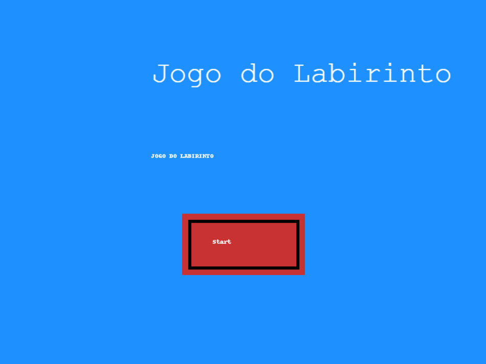

# Projeto do Labirinto 🌀

Este projeto é um jogo em estilo labirinto desenvolvido com **Phaser.js**, no qual o jogador precisa coletar chaves para avançar de fase enquanto evita inimigos.

⚡ **Observação**: Este jogo foi desenvolvido em colaboração com o professor. A estrutura principal do jogo foi fornecida, e a atividade consistiu em realizar alterações e complementações no projeto.

**Disponível em:** [Projeto do Labirinto](<https://stefannevictoria.github.io/atividades_ponderadas/AtividadeCompt/>)

## 📸 Screenshots



## 🛠️ Tecnologias Utilizadas

- **JavaScript**: Linguagem principal utilizada para a programação do jogo.
- **Phaser.js**: Framework para desenvolvimento de jogos em 2D, facilitando a criação de animações, física e interações.

## 📂 Estrutura do Projeto

- `index.html`: Arquivo principal que carrega o Phaser e inicializa o jogo.
- `assets/`: Pasta contendo as imagens e mapas utilizados no jogo.
- `script.js`: Cenas do jogo.

## 🚀 Como Executar

1. Clone o repositório:
    ```sh
    git clone <URL_DO_REPOSITORIO>
    ```
2. Navegue até o diretório do projeto:
    ```sh
    cd nome-do-projeto
    ```
3. Abra o arquivo `index.html` em um navegador web.

## 🎮 Como Jogar

- **Mover o personagem:** Utilize as teclas de seta (`←`, `→`, `↑`, `↓`) do teclado.
- **Objetivo na Fase 1:** Pegue a chave e entre pela porta para avançar.
- **Objetivo na Fase 2:** Colete 5 chaves espalhadas pela tela, sem colidir com os inimigos.
- **Evite:** Encostar nos inimigos leva ao Game Over.
- **Vitória:** Ao coletar todas as chaves na segunda fase, você vence o jogo.

## ✨ Funcionalidades

- **Sistema de Fases**: O jogo possui duas fases distintas, com desafios crescentes.
- **Inimigos móveis:** Personagens que se movem de forma autônoma e causam o Game Over ao colidir com o jogador.
- **Coleta de Itens:** Sistema de coleta de chaves que atualiza a pontuação em tempo real.
- **Cenas de vitória e derrota:** Transições visuais entre menu, jogo, vitória e derrota.
- **ísica Arcade:** Controle suave do personagem com colisões e rebotes.
- **Interface com Placar:** Exibe a pontuação do jogador em tempo real.

## 🔥 Alterações e Contribuições Realizadas

- Adição de comentários explicativos no código.
- Implementação da GameScene2, com dois inimigos e objetivo de coletar 5 chaves.
- Inclusão de um texto explicativo na GameScene2 sobre o objetivo da fase.
- Modificação do background da WinScene para um novo visual de vitória.