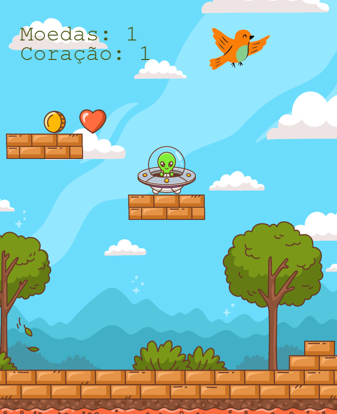

# Projeto do Alienígena 👽

Este projeto é um jogo simples desenvolvido com **Phaser.js**, onde um alienígena coleta moedas e corações enquanto desvia de obstáculos.

## 📸 Screenshots



## 🛠️ Tecnologias Utilizadas

- **JavaScript**: A linguagem de programação principal utilizada no desenvolvimento do jogo.
- **Phaser.js**: Framework para desenvolvimento de jogos em 2D, que facilita a criação de animações e interações.

## 📂 Estrutura do Projeto

-   `index.html`: Arquivo principal que carrega o Phaser e inicializa o jogo.
-   `assets/`: Pasta contendo os recursos gráficos do jogo.

## 🚀 Como Executar

1. Clone o repositório:
    ```sh
    git clone <URL_DO_REPOSITORIO>
    ```
2. Navegue até o diretório do projeto:
    ```sh
    cd nome-do-projeto
    ```
3. Abra o arquivo `index.html` em um navegador web.

## 🎮 Como Jogar

- **Mover para a esquerda**: Pressione a tecla `←`
- **Mover para a direita**: Pressione a tecla `→`
- **Pular / Modo turbo**: Pressione a tecla `↑`
- **Objetivo**: Colete moedas e corações enquanto evita os obstáculos.

## ✨ Funcionalidades

- **Movimentação do personagem**: O alienígena pode se mover para os lados e pular.
- **Coleta de itens**: Ao coletar moedas e corações, o placar é atualizado e a moeda/coração reaparece em uma nova posição.
- **Obstáculos**: O jogo inclui plataformas e um pássaro como desafios a serem evitados.
- **Efeito de turbo**: Quando o alienígena pula, um efeito visual de turbo é ativado.


