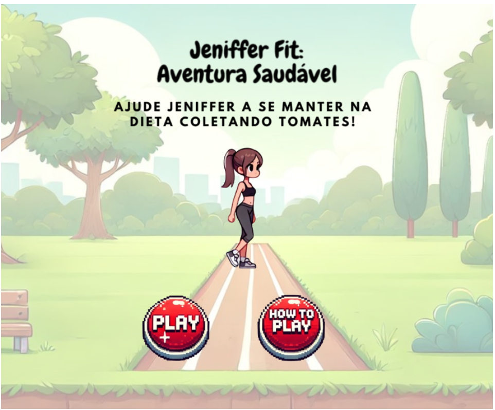

# Jeniffer Fit: Aventura Saudável 🍅

**"Jeniffer Fit: Aventura Saudável"** é um jogo simples desenvolvido com **Phaser.js**, em que a personagem Jeniffer precisa coletar tomates para manter sua dieta equilibrada.

**Disponível em:** [Jeniffer Fit](<https://stefannevictoria.github.io/atividades_ponderadas/ProjetoFit/index.html>)

## 📸 Screenshots



## 🛠️ Tecnologias Utilizadas

- **JavaScript**: A linguagem de programação principal utilizada no desenvolvimento do jogo.
- **Phaser.js**: Framework para desenvolvimento de jogos em 2D, que facilita a criação de animações e interações.

## 📂 Estrutura do Projeto

-   `index.html`: Arquivo principal que carrega o Phaser e inicializa o jogo.
-   `main.js`: Configurações gerais do jogo, incluindo a definição das cenas e configurações do Phaser.
-   `scenes/`: Pasta contendo as diferentes cenas do jogo.
    -   `game.js`: Cena principal do jogo.
    -   `gameOver.js`: Cena de fim de jogo, exibida quando o jogador vence. 
    -   `welcome.js`: Tela inicial do jogo, com botões de "Jogar" e "Como Jogar".
-   `assets/`: Pasta contendo os recursos gráficos do jogo.
    -   `botoes/`: Imagens dos botões do jogo.
    -   `textos/`: Textos utilizados no jogo.

## 🚀 Como Executar

1. Clone o repositório:
    ```sh
    git clone <URL_DO_REPOSITORIO>
    ```
2. Navegue até o diretório do projeto:
    ```sh
    cd nome-do-projeto
    ```
3. Abra o arquivo `index.html` em um navegador web.

## 🎮 Como Jogar

- **Mover para a esquerda**: Pressione a tecla `←`
- **Mover para a direita**: Pressione a tecla `→`
- **Pular / Modo turbo**: Pressione a tecla `↑`
- **Objetivo**: Colete tomates enquanto evita os obstáculos para ajudar Jeniffer a se manter na dieta.

## ✨ Funcionalidades

- **Movimentação do personagem**: A personagem pode se mover para os lados e pular.
- **Coleta de itens**: Ao coletar tomates, o placar é atualizado e o tomate reaparece em uma nova posição.
- **Obstáculos**: O jogo inclui plataformas como desafios a serem evitados.
- **Efeito de poeira**: Quando a personagem se move para os lados, um efeito visual de poeira é ativado.


