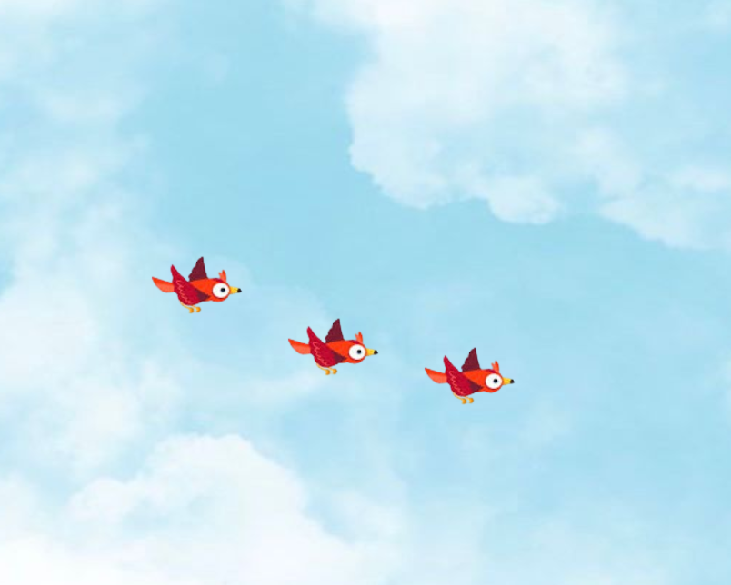

# Projeto do Pássaro 🐦 

Este projeto é um jogo simples desenvolvido com **Phaser.js**, em que pássaros animados voam horizontal e verticalmente em uma tela com fundo dinâmico.

## 📸 Screenshots



## 🛠️ Tecnologias Utilizadas

- **JavaScript**: A linguagem de programação principal utilizada no desenvolvimento do jogo.
- **Phaser.js**: Framework para desenvolvimento de jogos em 2D, que facilita a criação de animações e interações.

## 📂 Estrutura do Projeto

-   `index.html`: Arquivo principal que carrega os scripts e configura o jogo.
-   `assets/`: Pasta contendo os recursos visuais do jogo (fundo e spritesheet dos pássaros).

## 🚀 Como Executar

1. Clone o repositório:
    ```sh
    git clone <URL_DO_REPOSITORIO>
    ```
2. Navegue até o diretório do projeto:
    ```sh
    cd nome-do-projeto
    ```
3. Abra o arquivo `index.html` em um navegador web.

## ✨ Funcionalidades

- **Movimentação automática dos pássaros**: Eles se movem para frente e para trás, mudando de direção ao atingir os limites da tela.
- **Animação das asas**: Os pássaros possuem uma animação contínua de voo.
- **Movimento vertical dinâmico**: Além do deslocamento horizontal, os pássaros sobem e descem dentro de um limite da tela.
- **Redimensionamento do fundo**: O fundo do jogo se ajusta automaticamente ao tamanho da janela.
