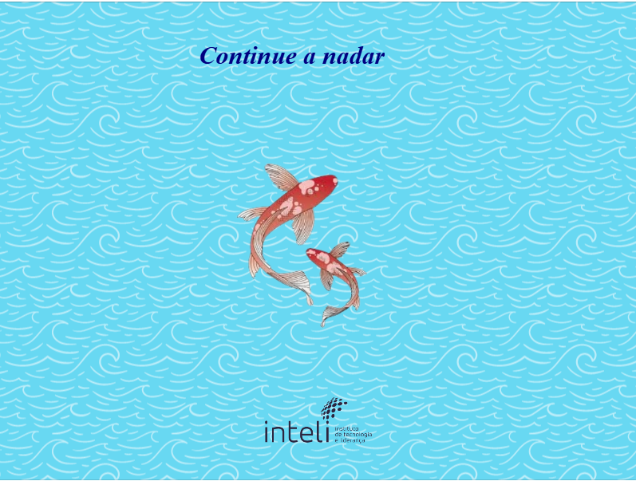

# Projeto do Peixe 🐠 

Este projeto é um jogo simples desenvolvido com **Phaser.js**, onde um peixe segue o movimento do mouse enquanto uma música de fundo é tocada.

## 📸 Screenshots



## 🛠️ Tecnologias Utilizadas

- **JavaScript**: A linguagem de programação principal utilizada no desenvolvimento do jogo.
- **Phaser.js**: Framework para desenvolvimento de jogos em 2D, que facilita a criação de animações e interações.

## 📂 Estrutura do Projeto

-   `index.html`: Arquivo HTML principal que carrega os scripts e define a estrutura da página.
-   `phaser.js`: Biblioteca Phaser (atualmente vazia, mas deve conter a biblioteca Phaser).
-   `peixe.js`: Script principal do jogo que configura e inicializa o jogo.
-   `assets/`: Pasta contendo os recursos do jogo, como imagens e áudio.
    -   `peixes/`: Imagens dos peixes.

## 🚀 Como Executar

1. Clone o repositório:
    ```sh
    git clone <URL_DO_REPOSITORIO>
    ```
2. Navegue até o diretório do projeto:
    ```sh
    cd nome-do-projeto
    ```
3. Abra o arquivo `index.html` em um navegador web.

## ✨ Funcionalidades

- **Movimentação do peixe**: O peixe segue a posição do cursor do mouse na tela.
- **Música de fundo**: Uma trilha sonora é carregada e tocada em loop automaticamente.
- **Redimensionamento de elementos**: O peixe e a logo são ajustados para melhor visualização.
- **Mensagem na tela**: Texto estilizado é exibido como parte do cenário.
